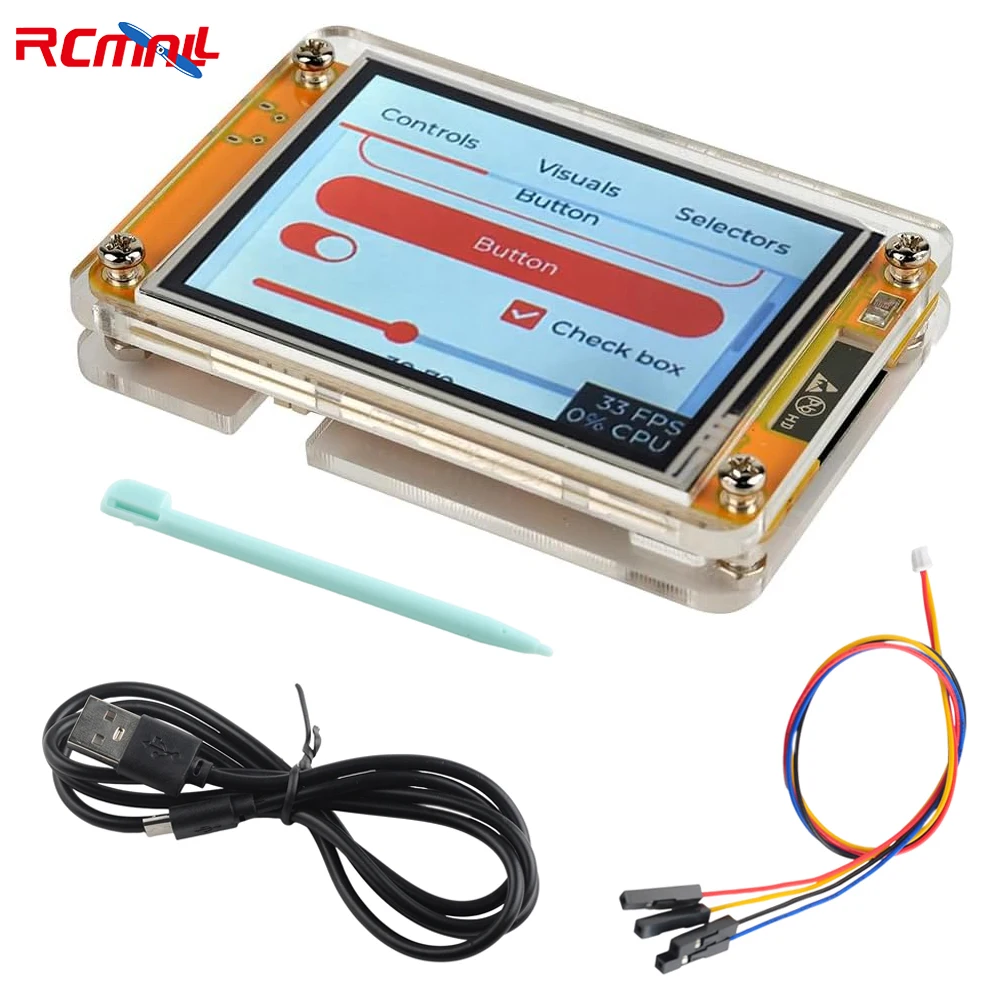
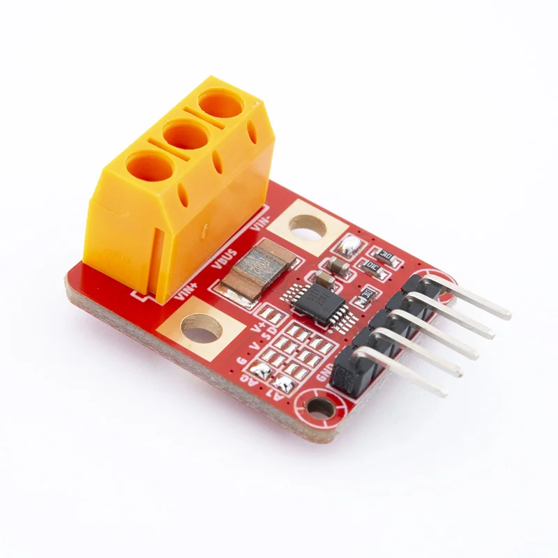

# CYD Smart Shunt

An ESP32 Cheap Yellow Display (CYD) based **DC current & voltage meter** with a modern LVGL touch UI and an **INA228 50A/75mV shunt**, plus support for other INA-family devices.

### What it does today

- **Dashboard**
  - Large **Current** and **Voltage** tiles
  - **Power** and **Energy** on the same row
  - **Temperature** readout
  - Long‑press **Energy** to reset accumulated energy/charge (with confirmation)
- **Sensors**
  - I2C auto‑detection for **INA228 / INA226 / INA219**
  - Per‑device backends behind a common `Sensor` API
- **Calibration & UX**
  - Touchscreen calibration stored in NVS and restored on boot
  - Shunt calibration: standard shunt list + known‑load calibration
  - Value entry with digit cursor, coarse/fine steps, and keypad fallback

## Hardware

- **Display**: ESP32‑2432S028R (“Cheap Yellow Display”)
  - 320×240 2.8" LCD (ILI9341)
  - Resistive touch (XPT2046)
  - ESP32 with Wi‑Fi + Bluetooth
- **Shunt / sensor**:
  - INA228‑based 50A/75mV 0.5% accuracy shunt
  - I2C sensor support: **INA228 / INA226 / INA219** (auto‑detected)
  - The linked INA2xx breakout boards ship with small onboard shunts  
    (typically **R002**, **R015** for INA238, and **R100**) that are fine for low/medium currents on the PCB itself;  
    for **higher current work you should use an external shunt** such as the CG FL‑2C block.  
    This requires **removing/desoldering the onboard shunt resistor and wiring the external shunt into its Kelvin pads** on the module.

## Getting started

### Prerequisites

- PlatformIO installed
- Appropriate USB‑UART driver for your CYD variant (e.g. CH340, CP210x, or built‑in OS driver; check your board/OS docs)

### Build and upload

```bash
# Build the project
pio run

# Upload to device
pio run -t upload

# Monitor serial output
pio device monitor
```

## Roadmap

- **UI / logging / alarms**
  - Dashboard polish (icons, formatting, smoothing, clearer error states)
  - Data page: min/max, session stats, export/logging
  - Alarms: over‑current / under‑voltage, configurable thresholds
  - Shunt calibration UX + persistence/versioning
- **Victron SmartShunt–style integration**
  - Serial output compatible with Victron‑style shunt telemetry
  - BLE / GATT broadcasting in a format that *VictronConnect might be able to read*

## Pin reference

### Display (HSPI)
- MISO: GPIO 12
- MOSI: GPIO 13
- SCK: GPIO 14
- CS: GPIO 15
- DC: GPIO 2
- RST: Connected to ESP32 RST
- Backlight: GPIO 21

### Touch screen (VSPI)
- IRQ: GPIO 36
- MOSI: GPIO 32
- MISO: GPIO 39
- CLK: GPIO 25
- CS: GPIO 33

### INA2xx shunt (I2C on CN1)
- SDA: GPIO 22
- SCL: GPIO 27
- 3.3V and GND available on CN1

## Wiring notes

This project is designed around a **high‑side shunt** (in the positive line), which is how the INA228/226/219 devices are intended to be used in the default configuration.  
You can also use the same hardware **low‑side** (in the negative return), but be aware of the different ground‑reference and noise implications in your system.

**High‑side FL‑2C + INA228 (recommended)**

```text
High current path (thick cable)

BATTERY +  ────────[  FL-2C SHUNT  ]────────  LOAD / FUSE BLOCK +
BATTERY -  ─────────────────────────────────  LOAD / FUSE BLOCK -

INA228 sense wiring (thin wires)

Because VBUS is tied to VIN+ on this design:

INA228 VIN+  ───────────────>  Shunt BATTERY side  (Kelvin sense)
INA228 VIN-  ───────────────>  Shunt LOAD side     (Kelvin sense)
INA228 VBUS  ──(tied to VIN+)─> same as VIN+

INA228 ↔ ESP32 (CN1 / I2C)

ESP32 3.3V  ───────────────>  INA228 VCC
ESP32 GND   ───────────────>  INA228 GND  ───────> Battery -
ESP32 IO22  (SDA) ─────────>  INA228 SDA
ESP32 IO27  (SCL) ─────────>  INA228 SCL
INA228 ALE  ───────────────>  (optional / leave unconnected)
```

**Combined view (high‑side shunt + sense + I2C)**

```text
            (THICK / HIGH CURRENT)

BAT+ -----> [  FL-2C SHUNT  ] -----> LOAD+
            |             |
           (A)           (B)

BAT- ------------------------------> LOAD-


            (THIN / SENSE WIRES)

INA228 VIN+  ---------------------> (A)  shunt battery side sense
INA228 VIN-  ---------------------> (B)  shunt load side sense
INA228 VBUS  ---- tied to VIN+ ---> (A)


            (THIN / I2C + POWER)

ESP32 3V3  -----------------------> INA228 VCC
ESP32 GND  -----------------------> INA228 GND ---------> BAT-
ESP32 SDA (GPIO22) ---------------> INA228 SDA
ESP32 SCL (GPIO27) ---------------> INA228 SCL
```






## Hardware links (affiliate)

- **Shunt (50A/75mV selected; other ranges work too)**: [`https://s.click.aliexpress.com/e/_c2xnLz9D`](https://s.click.aliexpress.com/e/_c2xnLz9D)
- **INA226 / INA228 / INA238 module**: [`https://s.click.aliexpress.com/e/_c3se5pX9`](https://s.click.aliexpress.com/e/_c3se5pX9)
- **CYD 2.8" ESP32‑2432S028R (ILI9341 + XPT2046)**: [`https://s.click.aliexpress.com/e/_c3MhOaqP`](https://s.click.aliexpress.com/e/_c3MhOaqP)

## References

- [ESP32‑Cheap‑Yellow‑Display](https://github.com/witnessmenow/ESP32-Cheap-Yellow-Display)
- [TFT_eSPI](https://github.com/Bodmer/TFT_eSPI)
- [XPT2046_Touchscreen](https://github.com/PaulStoffregen/XPT2046_Touchscreen)
